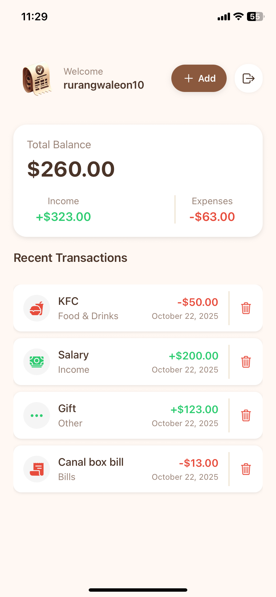
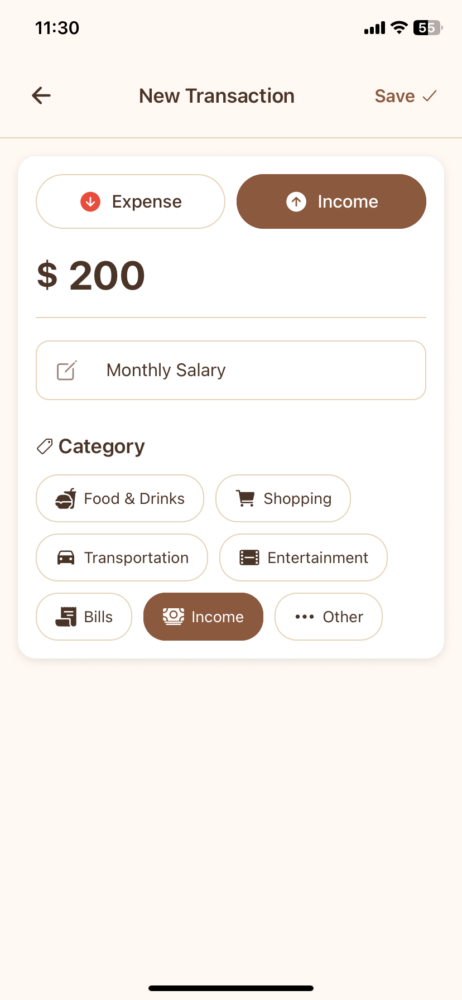
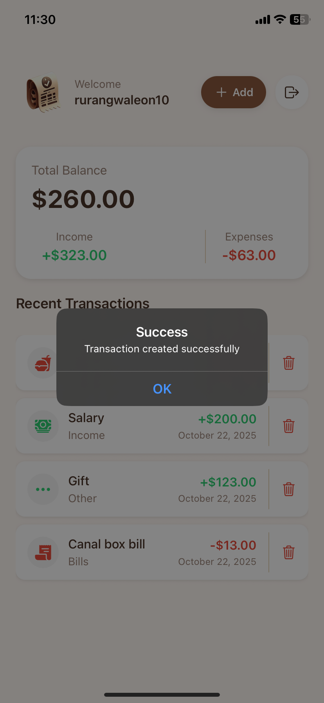
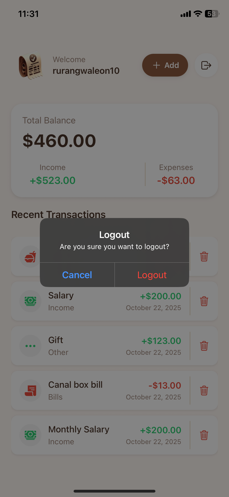

# Expense-Tracker-App (mobile)

Simple, cross-platform React Native expense tracker for logging, categorizing, and visualizing personal expenses.

## Screenshots

  
  
  
  
  
  

## Features
- Add, edit, and delete transactions  
- Categories  
- Summary by Income and Expense  
- Local persistence (SQLite / AsyncStorage) and optional remote sync  

## Tech Stack
- React Native ( Expo)  
- TypeScript
- Context API for state  
- React Navigation  

## Contact
Project: **Expense-Tracker-App** — rurangwaleon10@gmail.com
